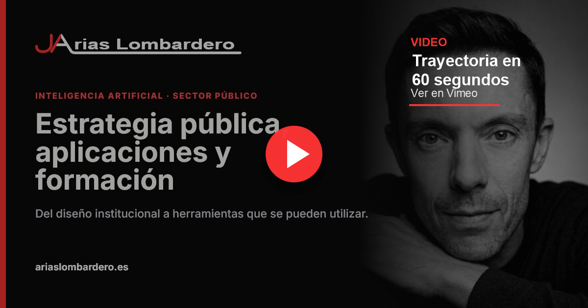

# Portfolio profesional | Jose Antonio Arias Lombardero

<div align="center">
  
  
  
  
</div>

<div align="center">
  <a href="https://vimeo.com/1213181131" aria-label="Ver trayectoria en 60 segundos en Vimeo">
    
  </a>
  <p><strong><a href="https://vimeo.com/1213181131">Ver trayectoria en 60 segundos</a></strong> · <a href="https://ariaslombardero.es/cv.html">Abrir trayectoria completa</a></p>
</div>

Este repositorio contiene el portfolio profesional de [Jose Antonio Arias Lombardero](https://ariaslombardero.es/), centrado en inteligencia artificial aplicada al sector público, estrategia institucional, aplicaciones con IA integrada, automatización pública, datos públicos y formación.

La web funciona como punto de entrada a la trayectoria, los casos de estudio, las aplicaciones y recursos desarrollados, la actividad como ponente y una oferta general de formación en inteligencia artificial para administraciones y organizaciones públicas.

> Nota del autor: este proyecto comenzó como un currículum interactivo y evolucionó hacia un ecosistema profesional. La portada resume el posicionamiento y conduce a páginas especializadas que permiten revisar experiencia, evidencias, herramientas y propuestas formativas sin convertir la página inicial en un currículum extenso.

## Características principales

- Portada profesional con acceso a estrategia, aplicaciones, formación, congresos y trayectoria.
- Trayectoria completa con experiencia, docencia acreditada, especialización en IA, publicaciones, premios, competencias, CV descargable y vídeo de trayectoria en 60 segundos.
- Casos de estudio sobre MencIA como estrategia provincial de inteligencia artificial y sobre reutilización de datos abiertos.
- Catálogo de aplicaciones con búsqueda, filtros por tipo de pieza y acceso a despliegues y repositorios públicos.
- Distinción explícita entre aplicaciones con IA integrada, recursos de formación sobre IA, estrategia de IA, automatización pública y datos públicos.
- Espacio de formación con programas adaptables, experiencia impartida y evidencias docentes.
- Recursos educativos integrados: vídeos, PDF, cuestionarios, flashcards, simuladores y actividades de gamificación.
- Archivo de congresos, jornadas y webinars con presentaciones y grabaciones disponibles.
- Sistema visual propio con territorios diferenciados para identidad profesional, aplicaciones y formación.
- Diseño responsive, navegación mediante teclado, foco visible y compatibilidad con movimiento reducido.
- Metadatos SEO, Open Graph, datos estructurados, `sitemap.xml`, `robots.txt` y manifiesto web.
- Sin backend, analítica, cookies ni formularios que almacenen información personal.

## Cómo funciona este repositorio

El proyecto combina una portada construida con React y varias páginas editoriales estáticas. Vite compila la aplicación principal y copia el contenido de `public/` al directorio final de producción.

```text
portfolio_personal_v3/
├── src/
│   ├── App.tsx                 # Portada y navegación principal
│   ├── index.css               # Estilos de la portada
│   └── main.tsx                # Entrada de React
├── public/
│   ├── cv.html                 # Trayectoria profesional completa
│   ├── congresos-webinars.html # Actividad como ponente
│   ├── casos/                  # Casos MencIA y Oasis Madrid
│   ├── aplicaciones/           # Catálogo de aplicaciones, IA, automatización y datos
│   ├── formacion/              # Oferta, programas y experiencia impartida
│   ├── brand/                  # Logotipos y variables del sistema visual
│   ├── social/                 # Imágenes Open Graph y Twitter Card
│   ├── assets/                 # CV y documentos descargables
│   ├── img/                    # Imágenes de proyectos y congresos
│   └── sw.js                   # Service worker y caché de recursos estáticos
├── index.html                  # Metadatos y contenedor de la aplicación
├── vercel.json                 # Rutas limpias para Formación y Aplicaciones
├── vite.config.ts              # Configuración local de Vite
└── package.json                # Dependencias y comandos del proyecto
```

### Rutas principales

- `/`: portada profesional.
- `/cv.html`: trayectoria, evidencias, CV descargable y vídeo de trayectoria en 60 segundos.
- `/casos/mencia.html`: MencIA, estrategia provincial de inteligencia artificial.
- `/casos/oasis-madrid.html`: aplicación basada en datos abiertos.
- `/aplicaciones/`: catálogo de aplicaciones, recursos, automatizaciones y piezas con IA integrada.
- `/formacion/`: capacidad docente y oferta formativa.
- `/formacion/programas.html`: programas configurables.
- `/formacion/caso-gestion-local.html`: experiencia formativa impartida.
- `/congresos-webinars.html`: congresos, jornadas y webinars.

Las páginas estáticas comparten navegación, firma, tipografía y pies de página. Cada territorio conserva una identidad cromática subordinada a la marca principal:

- Negro y rojo para identidad profesional, trayectoria y estrategia.
- Negro y azul para aplicaciones.
- Fondos claros, verde y azul funcional para formación.

El catálogo de aplicaciones separa la señal editorial de cada pieza. Solo algunas aplicaciones usan IA para funcionar; otras son recursos educativos sobre IA, automatizaciones, piezas de estrategia o servicios basados en datos públicos.

## Desarrollo asistido por IA (Vibe Coding)

Este portfolio es también una muestra de desarrollo asistido por inteligencia artificial. El trabajo se realizó mediante un proceso iterativo dirigido y revisado por el autor:

1. Definición del posicionamiento, las audiencias y la arquitectura de contenidos.
2. Análisis del portfolio anterior, el CV y las evidencias profesionales disponibles.
3. Diseño del sistema visual, la marca personal y los territorios de estrategia, aplicaciones y formación.
4. Generación y refactorización asistida de componentes React, HTML, CSS y JavaScript.
5. Integración de documentos, aplicaciones, vídeos de Vimeo, recursos educativos y enlaces externos.
6. Revisión editorial de textos, jerarquías, llamadas a la acción y diferenciación entre experiencia acreditada y propuestas adaptables.
7. Pruebas locales de compilación, rutas, responsive, accesibilidad, enlaces y recursos multimedia.

La IA se utilizó como herramienta de análisis, programación, diseño y control de calidad. Las decisiones sobre contenido, identidad, evidencias publicadas y resultado final corresponden al autor. El proyecto no presenta la generación automática como sustituto de la revisión profesional.

## Stack tecnológico

- React 19.
- TypeScript 5.
- Vite 6.
- CSS propio y sistema de variables compartidas.
- Lucide React para iconografía funcional.
- HTML, CSS y JavaScript estáticos para páginas editoriales e interactivos.
- Service worker propio para soporte PWA y caché controlada de recursos estáticos.
- npm y Node.js para desarrollo y compilación.
- Vercel para despliegue continuo desde GitHub.

## Instalación y uso local

1. Clona el repositorio:

   ```bash
   git clone https://github.com/ariaslombardero/Portfolio-personal.git
   ```

2. Accede al directorio:

   ```bash
   cd Portfolio-personal
   ```

3. Instala las dependencias:

   ```bash
   npm install
   ```

4. Inicia el servidor de desarrollo:

   ```bash
   npm run dev
   ```

5. Comprueba los tipos y genera la versión de producción:

   ```bash
   npm run lint
   npm run build
   ```

La compilación se genera en `dist/`. Esta carpeta no se versiona porque Vercel ejecuta el proceso de construcción a partir del código fuente.

## Despliegue

El repositorio está preparado para un proyecto de Vercel conectado a la rama de producción:

- Framework preset: Vite.
- Comando de compilación: `npm run build`.
- Directorio de salida: `dist`.
- Directorio raíz: la raíz del repositorio.

Cada actualización de la rama de producción genera un nuevo despliegue. Las rutas `/formacion/` y `/aplicaciones/` se resuelven mediante `vercel.json`.

El service worker usa una versión de caché propia y solicita primero a red scripts, estilos y manifiesto. Esto evita que el catálogo de aplicaciones se quede con JavaScript antiguo después de cambios en filtros o taxonomías.

## 👨‍💻 Autor

**Jose Antonio Arias Lombardero**
*Experto en Inteligencia Artificial aplicada al sector público, innovación, contratación y fondos europeos.*

Esta aplicación forma parte de un portfolio de soluciones tecnológicas conceptualizadas, desarrolladas y desplegadas en entornos cloud para su aplicación en el sector público. Mi objetivo es demostrar cómo el uso estratégico de modelos avanzados de IA (Vibe Coding) puede escalar radicalmente la digitalización, la operatividad y la alfabetización tecnológica de la Administración.

🔗 [Consulta mi portfolio completo de aplicaciones y trayectoria profesional](https://ariaslombardero.es/)
